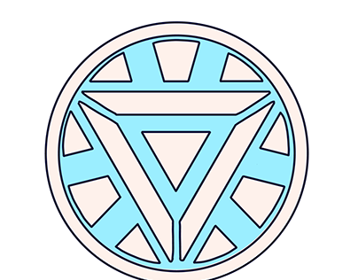
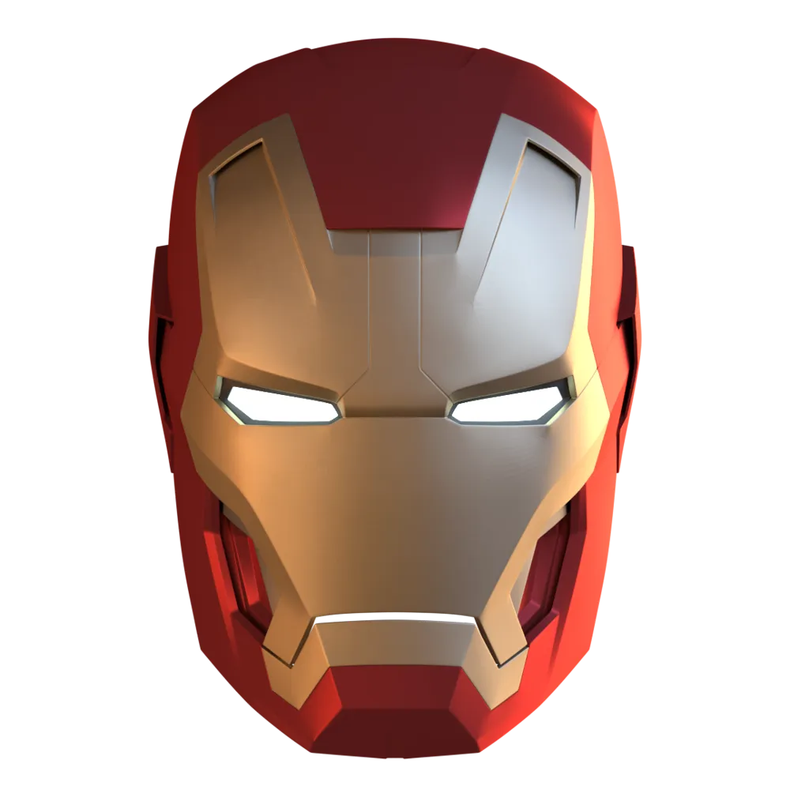
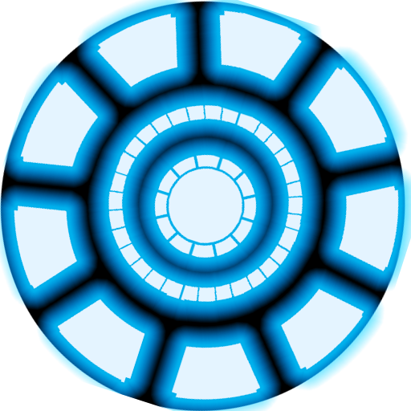
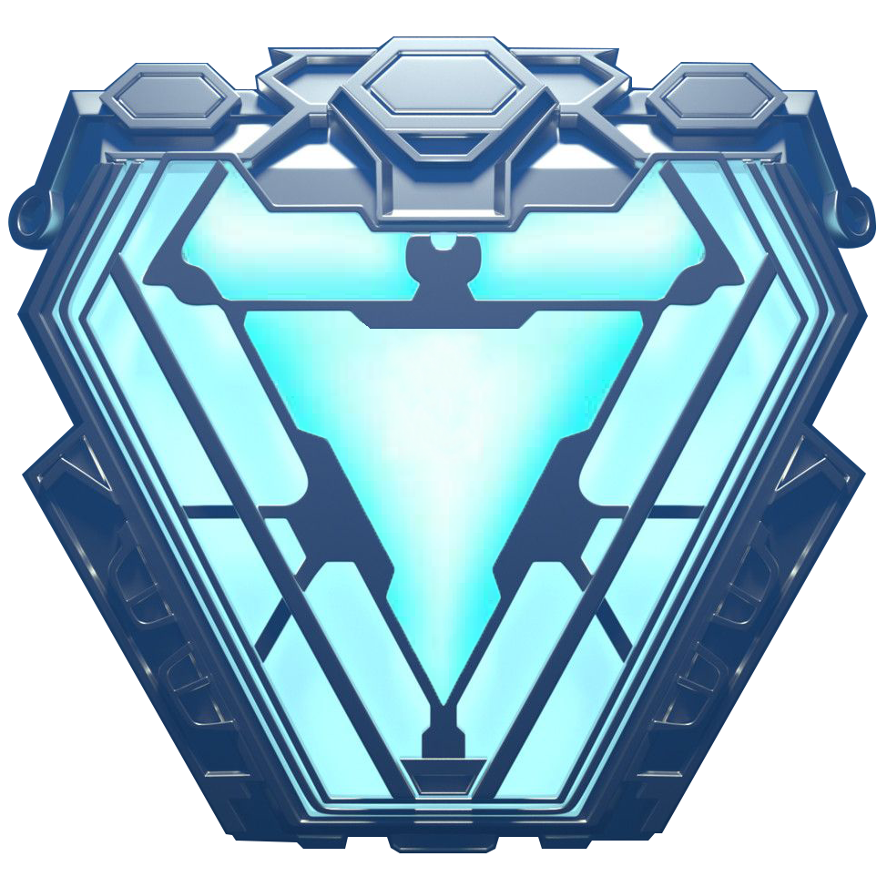
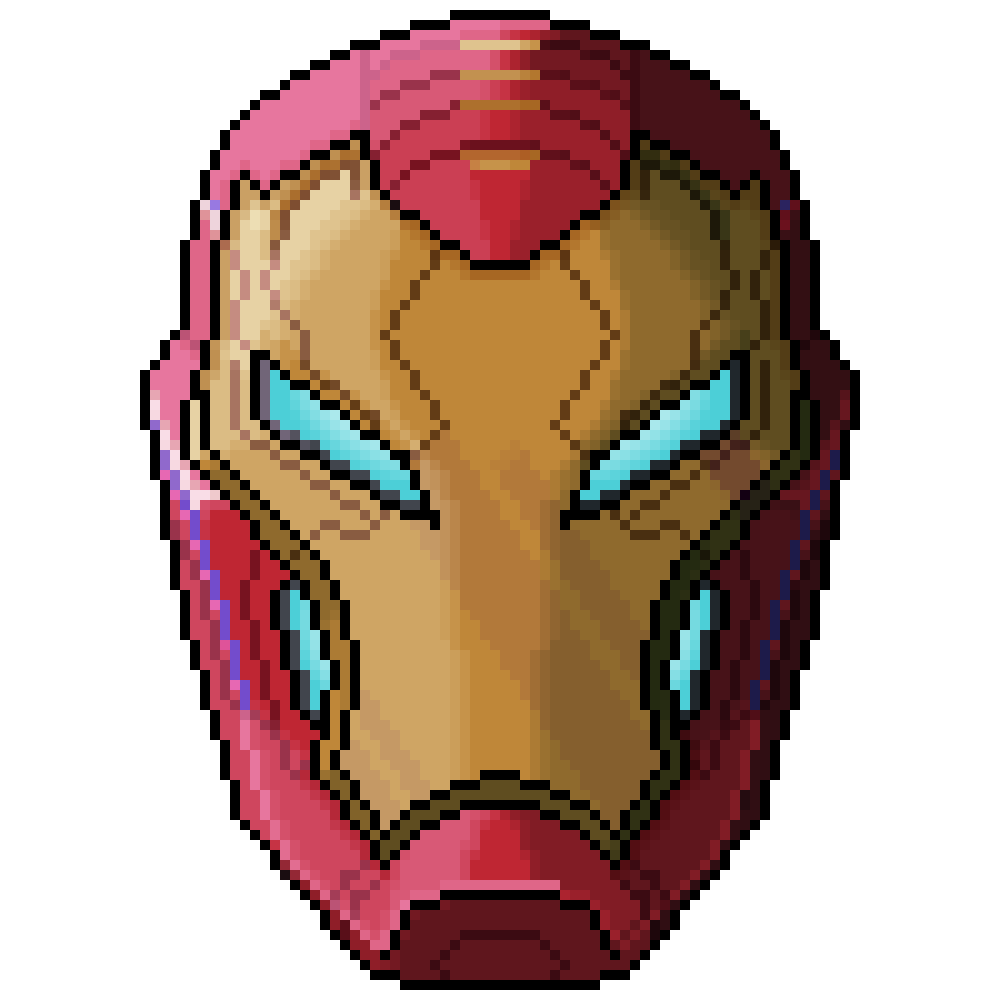

  <h1>José Amezcua López</h1>
  <h3>Mechatronics Engineer | Embedded Systems | Firmware & Hardware</h3>

  

    Embedded systems, low-power firmware, IoT node architecture, industrial communication and automation.
  

  
  
  

  
  <b>About Me</b>

 

I am a Mechatronics Engineer focused on **embedded systems, firmware development and hardware integration**.

- Experience developing **modular firmware in C/C++** and working with **FreeRTOS**.
- Experience with **LoRaWAN**, **RS-485** and industrial communication protocols such as **Modbus RTU**.
- Embedded development using **STM32, PIC, ESP32, nRF52 and RAK3172**.
- Experience integrating sensors, actuators, industrial controllers and communication interfaces.
- Interested in **low-power embedded systems, industrial IoT, automation and robotics**.
- Strong multidisciplinary background combining **electronics, programming, control systems and mechanical design**.

 

  
  <b>Featured Projects & Firmware</b>

 

###  AgroRak — Industrial Agro-IoT Node
**Professional Residency Project**

> **SoC:** RAK3172 (STM32WLE5) | **Language:** Native C | **Environment:** STM32CubeIDE / HAL  
> **Protocols:** Modbus RTU (RS-485), LoRaWAN (US915)

- **Firmware & Protocols:** Developed a non-blocking Modbus RTU Master driver with CRC16 verification for reading multi-variable sensors.
- **Power Optimization:** Implemented GPIO-based power gating to disconnect peripheral power during low-power Sleep/Stop modes.
- **Binary Payload:** Designed and packaged efficient 10-byte binary payloads for RF transmission to ThingsBoard.

---

### Automated Bottling System — STM32 + ABB PLC

> **Stack:** STM32 Nucleo F446RE, C, ABB PLC, HMI, SolidWorks

- **Embedded Control:** Firmware for tank-level, temperature and bottle-position monitoring.
- **Industrial Automation:** Integration between STM32, ABB PLC and HMI for process control and telemetry.
- **System Integration:** Combined embedded electronics, industrial automation and mechanical subsystems into a complete automated process.

---

### Marlin — Autonomous Robot
**National Innobótica Representative**

> **Language:** C++ | **Events:** InnovaTecNM 2025 & SYNAPSIA (UNAM)

- **Autonomous Navigation:** Developed maze-solving and real-time obstacle avoidance algorithms.
- **Closed-Loop Control:** Implemented sensor processing and timing-critical routines for autonomous operation.

---

### Tank Level Control & Telemetry System

> **Stack:** C/C++ (STM32 Nucleo-F446RE & PIC16F877A), C# WinForms, SQL Server

- **Discrete Control:** Implemented a PD controller for closed-loop level and flow regulation.
- **Serial Telemetry:** Developed UART communication with custom frame parsing at 60 ms intervals.
- **HMI:** Integrated the embedded controller with a C# monitoring interface.

---

### Mechatronic Claw Machine & VHDL Control Units

> **Stack:** C, VHDL, Intel Quartus Prime, Bluetooth Serial

- **Motor Control:** PIC16F877A firmware for NEMA stepper motors, servomotors and calibration routines.
- **Digital Logic:** Designed VHDL Finite State Machines for timers, counters and decoding.
- **Hardware Integration:** Combined embedded firmware, digital logic and electromechanical systems.

 

<b> Technology Stack</b>

 

<table width="100%">
<tr>

<td width="50%" valign="top" align="center">

<h4>Microcontrollers & SoCs</h4>

<h4>Languages, RTOS & Environments</h4>

<h4>IDEs & Toolchains</h4>

</td>

<td width="50%" valign="top" align="center">

<h4>Protocols & Communication</h4>

<h4>Hardware Design & Tools</h4>

</td>

</tr>
</table>

 

<b> Education</b>

 

### Mechatronics Engineering
**Tecnológico Nacional de México — Campus Colima**

2021 – 2026

Focus areas:

- Embedded Systems
- Industrial Automation
- Control Systems
- Electronics
- Mechanical Design
- Industrial Communication

 

<b> GitHub Activity</b>

 

  

 

<b> One Last Thing...</b>

### My Work Philosophy

> *"Sometimes you gotta run before you can walk."*

**— Tony Stark**

